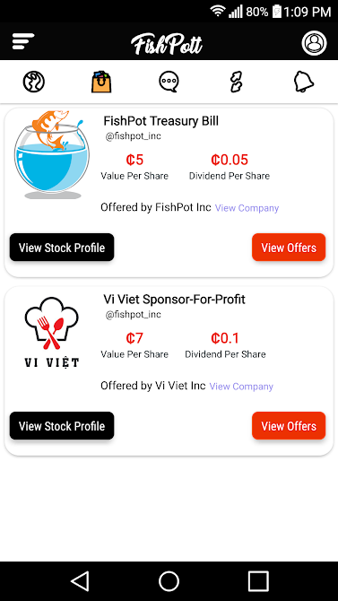
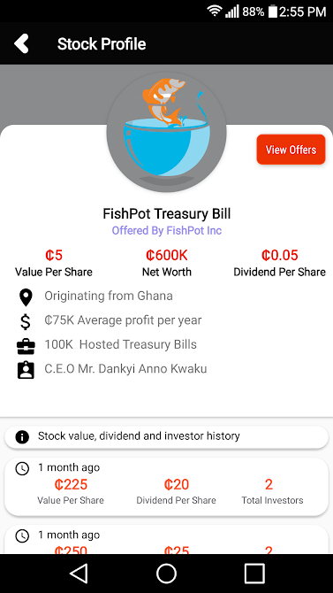
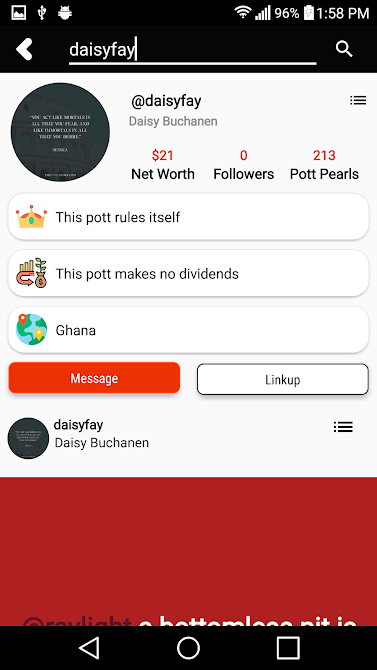
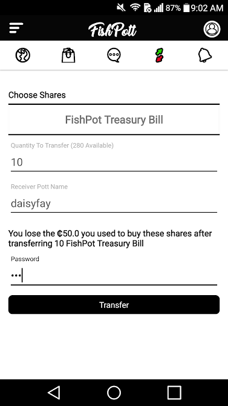

# FISHPOTT - Social-Commerce Networking 

**FishPott is a socio-commerce networking platformthat connects you, friends and businesses. Find a business you love, and invest in them. If it's doing well, you can easily tell your friends to invest too. Stay connected to the business and watch as the medium-sized business you believed in grow and scale, increasing the value of your investment and paying you dividends**

## Features
* Connect with businesses and people
* Invest by buying stocks of businesses around the world
* Transfer stocks with ease
* Chat/Messenger


### DOWNLOAD ON GOOGLE PLAYSTORE
```
https://play.google.com/store/apps/details?id=com.fishpott.fishpott5&hl=en_AU
```
## Screenshots
</br>
<div align="center">
   <table align="center" border="0" >
  <tr>
    <td>
      
    <td>
      
    </td>
    <td> 
     
    </td>
  </table>
  </div>
</br>
<div align="center">
  <table align="center" border="0" >
  <tr>
    <td> 
     
    </td>
    <td> 
     
    </td>
    <td> 
     
    </td>
  </tr>
</table>
  </div>
</br>
<div align="center">
  <table align="center" border="0" >
  <tr>
    <td> 
     
    </td>
    <td> 
     
    </td>
  </tr>
</table>
  </div>
## Authors

* **Dankyi Anno Kwaku** - *FishPot Company Limited*


